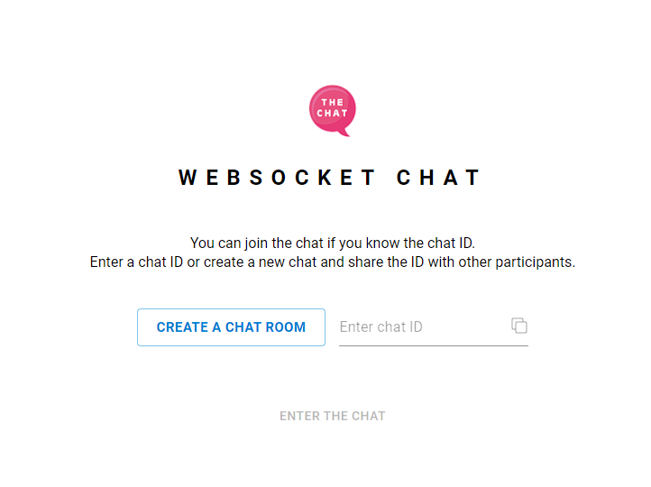

# WEBSOCKET CHAT

Simple chat made for fun and practice.
This is a front-end part of the chat. Back-end is [here](https://github.com/ukrwebprom/websocket-chat-server)

## How it works

WebSocket Chat does not create user accounts. Instead, the chat uses Google Authentication, so you'll need to Log In first.

WebSocket Chat does not have a common space for all participants. Instead, you can create a chat room and invite other members to it. Each room has an ID. When you create a room, you get an ID that you need to share with other meeting participants.

To enter an already existing chat you just need to enter the chat ID in the input field. If the chat still exists, ENTER THE CHAT button gets enabled and you will be able to connect to the chat.

## Back end

The backend lives on the Heroku server and includes both Http and Websocket servers. The Websocket server is used to receive and send messages to all users participating in the chat. The Http server provides endpoints for creating a new chat, checking the status of a chat, getting a list of participants, adding and removing chat users.

## Used technologies and libraries

**Front end** - React, sass, Firebase, Axios, Material UI
**Back end** - Node js, WS, Express

## Have a nice chat

Any comments or suggestions: ukrwebprom@gmail.com or [Y_Pochtiennykh](https://t.me/Y_Pochtiennykh)

P.S. Play our games [Gameboat](https://play.google.com/store/apps/dev?id=8963674542756618187)